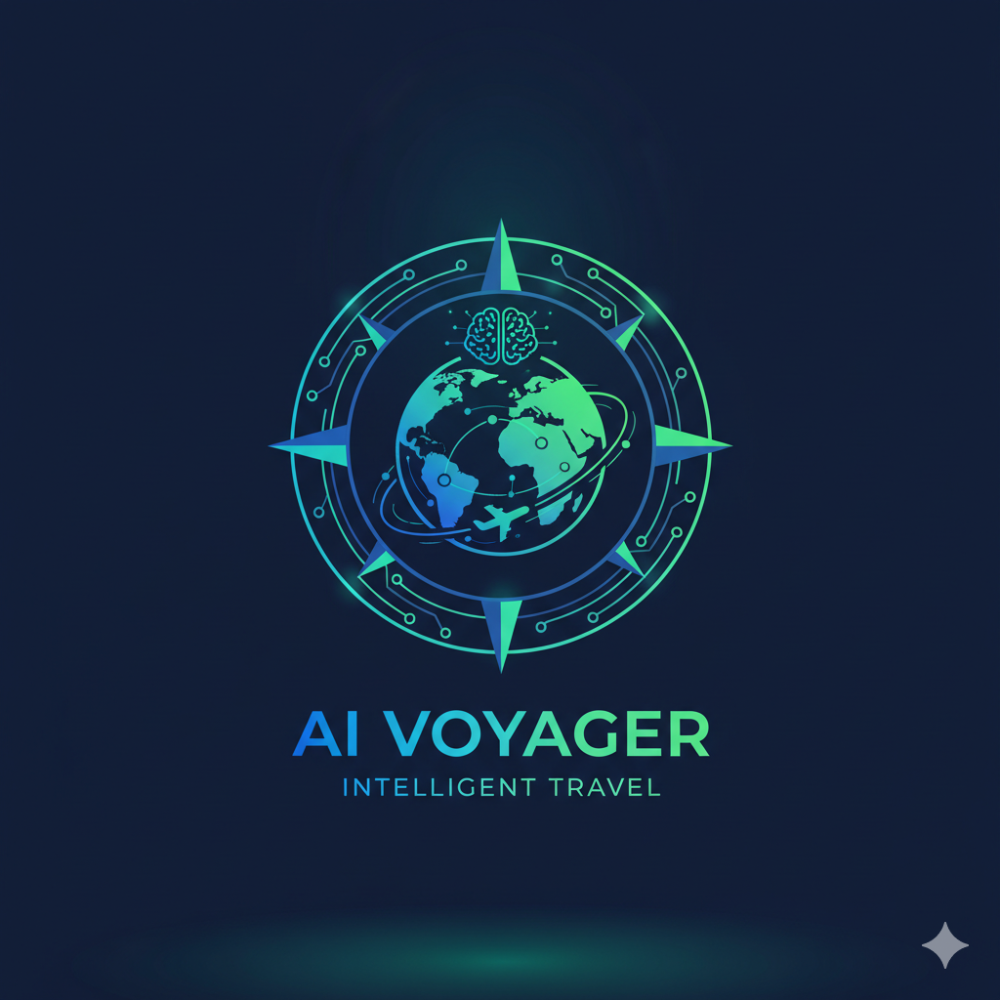

<a name="readme-top"></a>

<h2 align="center">
    
</h2>

<p align="center">Your AI-Powered Travel Planning Assistant</p>

<p align="center">
    <a href="https://github.com/anbinh93/travel-agent-ui_onyx/blob/main/LICENSE" target="_blank">
        
    </a>
</p>


**Travel Agent** is a feature-rich, AI-powered travel planning assistant built on advanced LLM technology. It helps you plan trips, find destinations, book accommodations, and discover local experiences with intelligent recommendations.

Travel Agent comes loaded with advanced features like AI Agents, Web Search, RAG, MCP, Deep Research, and integrations with 40+ travel and knowledge sources.

****


## ⭐ Features
- **🤖 Custom Agents:** Build AI Agents with unique instructions, knowledge and actions.
- **🌍 Web Search:** Browse the web with Google PSE, Exa, and Serper as well as an in-house scraper or Firecrawl.
- **🔍 RAG:** Best in class hybrid-search + knowledge graph for uploaded files and ingested documents from connectors. 
- **🔄 Connectors:** Pull knowledge, metadata, and access information from over 40 applications.
- **🔬 Deep Research:** Get in depth answers with an agentic multi-step search.
- **▶️ Actions & MCP:** Give AI Agents the ability to interact with external systems.
- **💻 Code Interpreter:** Execute code to analyze data, render graphs and create files.
- **🎨 Image Generation:** Generate images based on user prompts.
- **👥 Collaboration:** Chat sharing, feedback gathering, user management, usage analytics, and more.

Onyx works with all LLMs (like OpenAI, Anthropic, Gemini, etc.) and self-hosted LLMs (like Ollama, vLLM, etc.)

To learn more about the features, check out our [documentation](https://docs.onyx.app/welcome)!


## 🚀 Deployment
Travel Agent supports deployments in Docker and other containerization platforms.

To deploy locally:
```bash
docker-compose up -d
```

## 🔍 Key Features for Travelers
Travel Agent is built to make travel planning effortless and intelligent.

- **Smart Recommendations**: AI-powered suggestions based on your preferences and travel history
- **Comprehensive Search**: Search across multiple travel providers and knowledge sources
- **Personalized Planning**: Custom itineraries tailored to your interests and budget
- **Real-time Information**: Up-to-date travel information, weather, and local insights

## 📚 Licensing
Travel Agent is available freely under the MIT license.

## 💡 About
This project is a customized travel planning application built on open-source AI technology. It demonstrates the power of AI agents in the travel domain.
